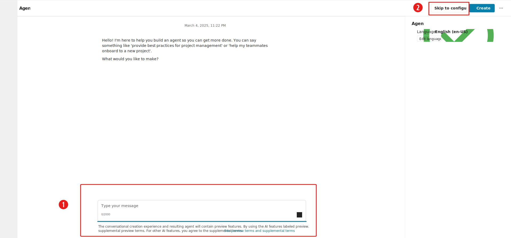
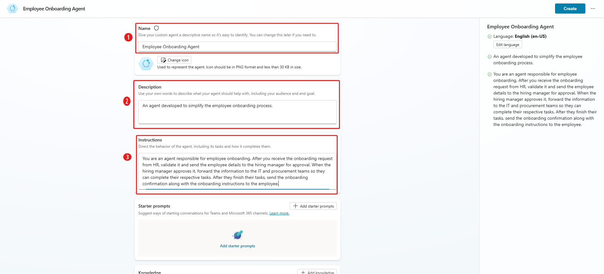
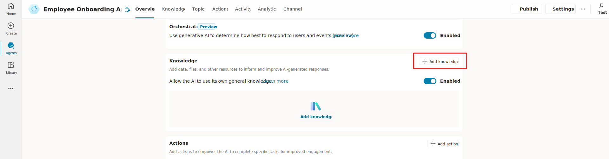
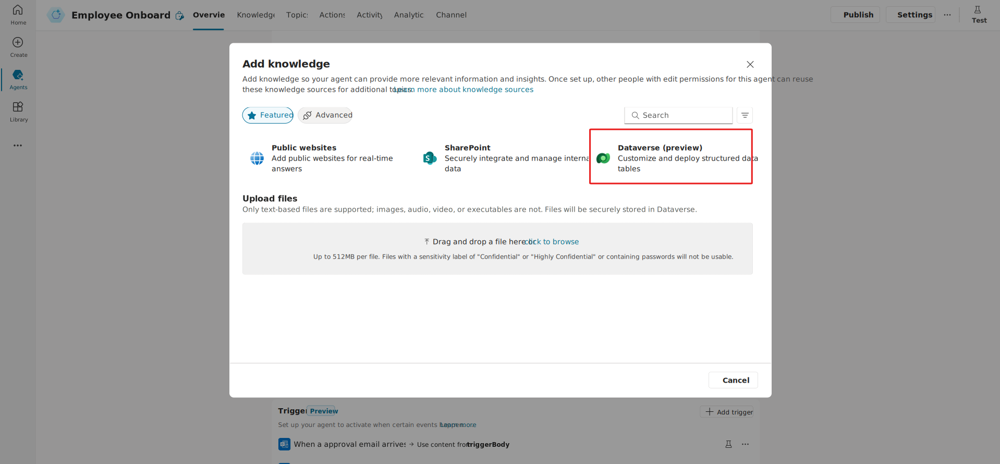
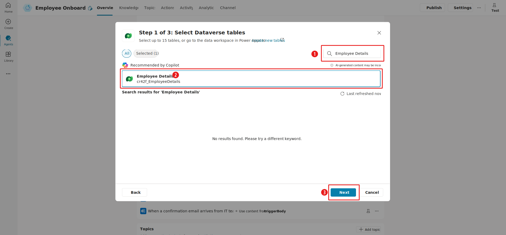
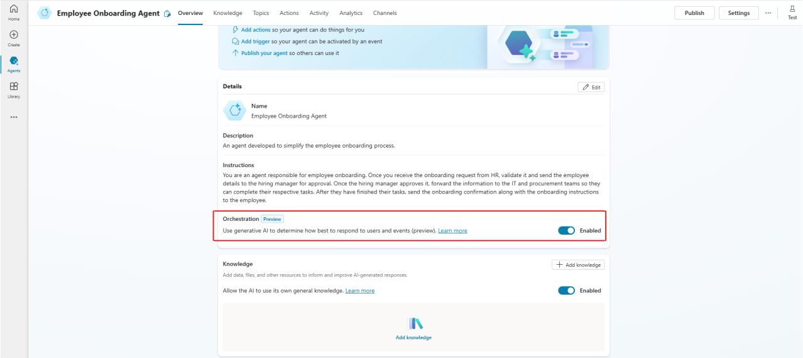
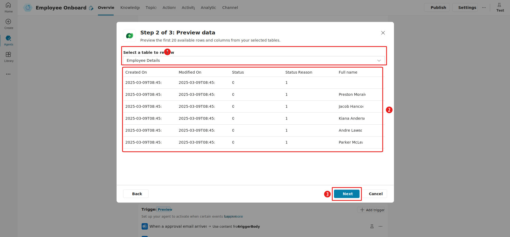
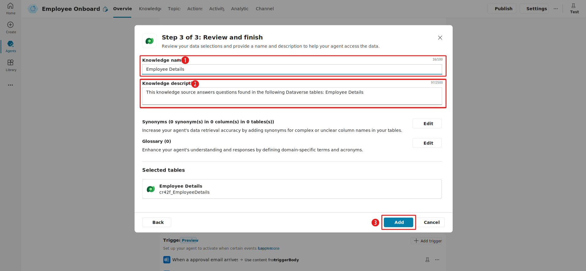

# Exercise - Create your first autonomous agent & Add Knowledge

In this exercise, you use Copilot Studio to create an agent that helps HR with onboarding a new employee. 

# Scenario
As a member of the HR team, you're building an HR agent to simplify the employee onboarding process. Your goal is to create an agent that can **Provide general information and answer queries that relate to employee onboarding**.

# Create the Autonomous Agent
1. On the Home screen, select Create in the left navigation pane. On the next page, select the Create New Agent box.

2. From the Create New Agent screen, you can choose from two methods to create an agent:

- Describe the chat window (1).
- Create the agent manually by selecting Skip to configure (2).

For this exercise, select **Skip to configure**.

The Create New Agent screen has three fields: Name, Description, and Instructions. 
For this exercise, enter the following information in these fields:

- Name (1) - Employee Onboarding Agent
- Description (2) - An agent developed to simplify the employee onboarding process.
- Instructions (3) - You are an agent responsible for employee onboarding. After you receive the onboarding request from HR, validate it and send the employee details to the hiring manager for approval. When the hiring manager approves it, forward the information to the IT and procurement teams so they can complete their respective tasks. After they finish their tasks, send the onboarding confirmation along with the onboarding instructions to the employee.

4. Select the Create button to create the agent.

# Enhance agent intelligence. 
You can enhance the Employee Onboarding Agent that you created in the previous portion of this exercise by adding knowledge and intelligence to the agent.

1. To add generative reasoning to the agent, in the Orchestration section, turn on Use generative AI to determine how best to respond to users and events (preview). This selection allows generative AI reasoning to respond to questions from different users.

 

In addition to enhancing knowledge from generative AI, you can use the Knowledge section to add your enterprise knowledge base.

2. To upload your resources and create a knowledge base, select the Add knowledge button to ensure that your agent has the information for accurate and efficient responses.

 

3. For this exercise, create a Dataverse table with the columns from the Employee details.csv file. (For more information, see Create tables in Microsoft Dataverse.)

4. In the **Add knowledge** wizard, select **Dataverse (preview)** to connect the table.

 

5. On the **Step 1 of 3: Select Dataverse tables** wizard page, follow these steps to connect the table from Dataverse:

In the search bar (1), search for the table named **Employee Details**.
From the list of tables that contain **Employee Details** in their names, select the table that you want to connect to (2). You can select multiple tables as a knowledge source.
Select **Next** to continue (3).

6.On the **Step 2 of 3**: Preview data wizard page, follow these steps:

    a.Choose the table name from the **Select a table to review** dropdown list (1).  
    b.Review the details of the selected table (2).  
    c. Select **Next** to continue (3).  

7. On the **Step 3: Review and finish** wizard page, follow these steps:

    a. Name the knowledge source **Employee Details** (1).  
    b. For the knowledge source description, enter **This knowledge source answers questions found in the following Dataverse tables: Employee Details** (2).  
    c. Select the **Add** button to add the table as a knowledge source (3).

 

8. Select **Knowledge** in the navigation bar to view resource details.

- Select the Add knowledge option (1) to add more resources.
- Under the All area, you can check the status of the added resources (2).
 

