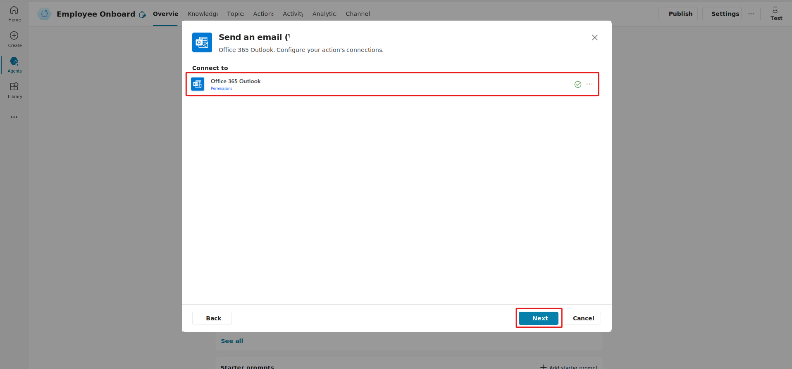
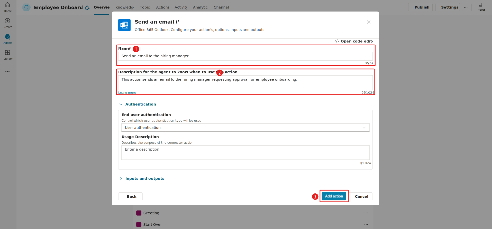
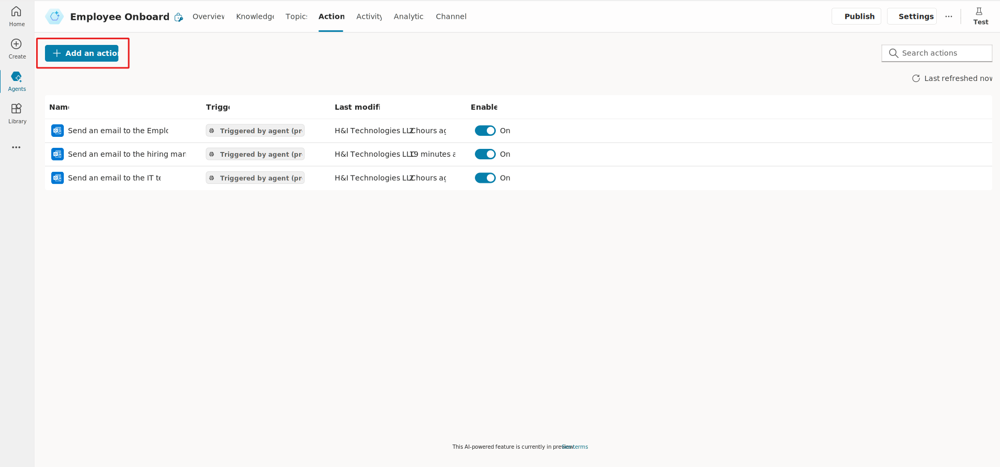

# Create and Configure Actions

When you turn on **generative orchestration**, your agent can automatically choose the most suitable action or topic, or it can search through knowledge to respond to the user.

In this exercise, you will have the agent manage employee onboarding by sending an email approval to the hiring manager to onboard the new employee. Since the agent continues to take specific actions, you need to add actions to the agent.

---

### **Add an Action**

1. Select the **+ Add action** option from the Overview screen to add an action.

   

2. In the **Add action wizard**, search for the **Send an email (V2)** connector and select it to proceed to the next step.

   

3. By default, **Send an email (V2)** links to the Microsoft Office 365 Outlook account associated with the Copilot Studio account (your organization's Office account).  
   Select **Next** to continue.

   

---

### **Configure the Action**

- In the **Name** field, enter: `Send an email to the hiring manager`.
- In the **Description** field, enter:  
  `This action sends an email to the hiring manager requesting approval for employee onboarding so that the agent knows when to trigger this action.`
- Select **Add action** to continue.

   

---

### **Create Additional Actions**

For the employee onboarding use case, you need to create two more actions:

- **Send an email to the IT team for approval.**
- **Send a final email to the employee with onboarding details.**

Repeat the steps for **Add action** to create the remaining two actions.  
After you create the actions, the Action screen displays all three actions. On the agent screen, you can turn off specific actions for the agent.

   
