# Create and configure the triggers

Triggers help to initiate an action based on the agent functions. In this case, you need to create triggers to:

- Initiate the onboarding process when an employee is added to the Dataverse table.
- Initiate an email to the hiring manager to onboard an employee.
- Send another email to the IT team to set up the employee's access when the agent receives the approval email.
- Send a Welcome email to the employee that includes all access details after the agent receives the completion email from the IT team.

---

### Follow these steps to create the triggers:

1. To add a trigger to the agent, select **Add trigger** in the Triggers section of the agent's Overview tab. The Add trigger wizard opens.

---

2. From the **Add trigger wizard**, select **When a row is added, modified or deleted**.

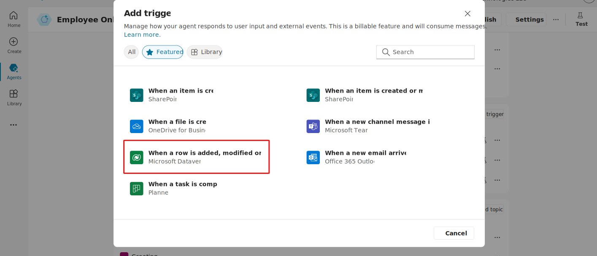

---

3. Name the trigger **When a new employee is added**.

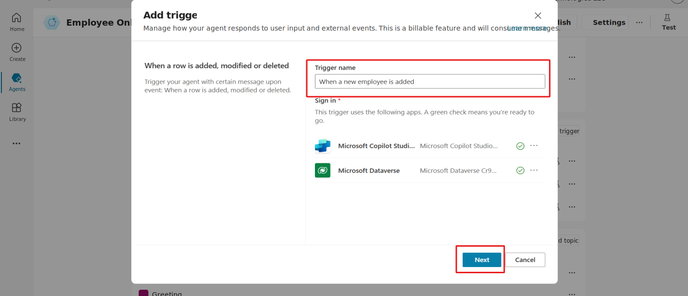

---

4. From the **Change type dropdown list (1)**, select **Added**.  
5. From the **Table name dropdown list (2)**, select the Dataverse table that you want to connect to.  
6. From the **Scope dropdown list (3)**, select the scope.  
7. Select **Create trigger (4)**.

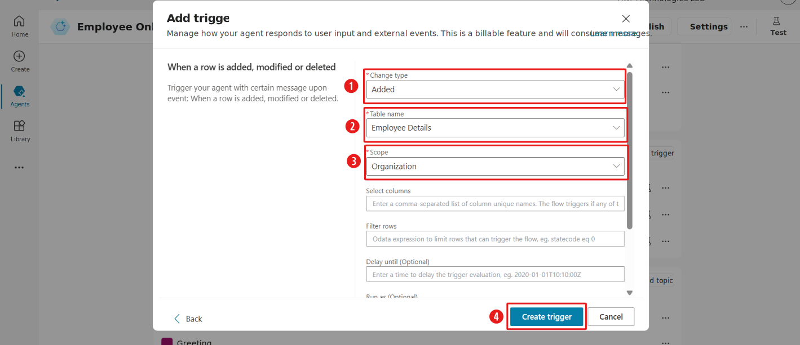

---

8. To add a trigger to the agent, select **Add trigger** in the Triggers section of the agent's Overview tab. The Add trigger wizard opens.

---

9. Select **When a new email arrives (V3)** in the Add trigger wizard.
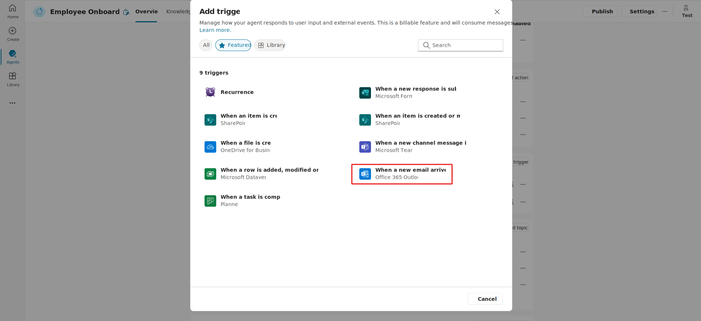

---

10. In the **Trigger name box (1)**, enter the trigger name as **When a confirmation email arrives from IT team (V3)**.    
11.In the **sign-in section for the Microsoft Copilot Studio app (2)**, if a green check mark appears, it means that the app is connected.  
12. In the **sign-in section for the Office 365 Outlook app (3)**, if a green check mark appears, it means that the app is already connected.  
Select the **Next button** to continue.

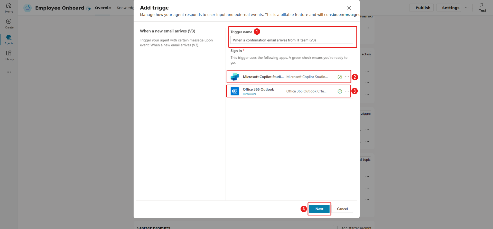

---

13. In the **Next section**, you can add a trigger and an action based on a message. In the next part, you edit the trigger and add a Power Automate flow to perform the action. However, for now, leave this screen blank.  
Select the **Create trigger** option to create the trigger.

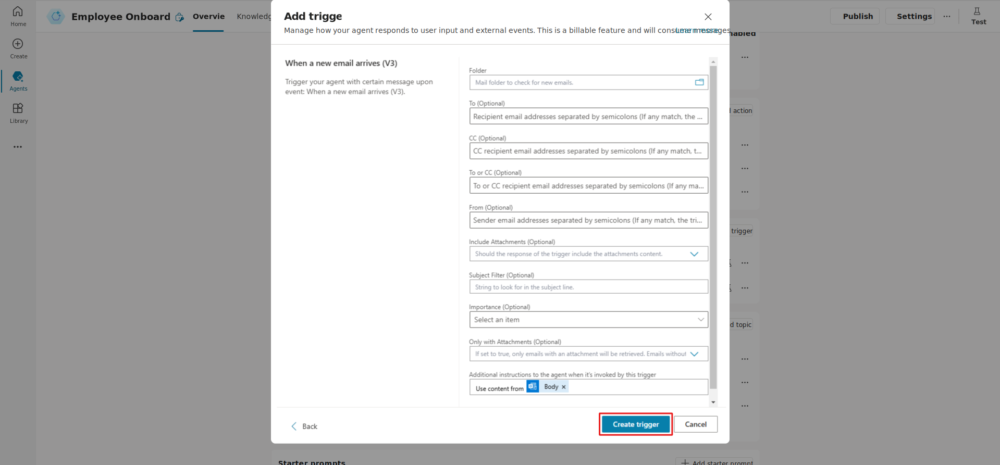

---
14. To edit the trigger that you created, follow these steps:

- Select the ellipsis (...) on the **When an approval email arrives (V3)** trigger to open a dialog (1).
- Select **Edit in Power Automate** in the dialog to go to the Power Automate page (2).

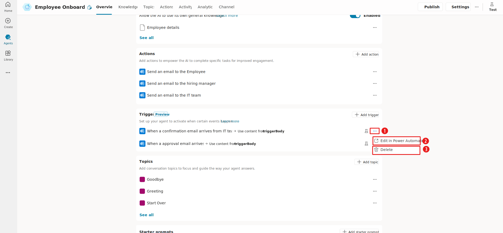

---

15. To set up the trigger for the agent to respond to the email from the hiring manager when the email is received, follow these steps:

- Select **When a new email arrives (V3)** (1).  
- In the **Subject filter section**, add **Onboarding request for the Employee** (2).  
- Select **Save draft** (3).


---

16. To create another trigger when a confirmation email arrives from the IT team, follow these steps:

- Select the **Add trigger** option in the Triggers section of the agent home page to open the Add trigger wizard.  
- Select **When a new email arrives (V3)** from the Add trigger wizard.  
- In the **Trigger name box (1)**, enter the trigger name as **When a confirmation email arrives from IT team (V3)**.  
- In the **sign-in section for the Microsoft Copilot Studio app (2)**, if a green check mark appears, it means that the app is connected.  
- In the **sign-in section for the Office 365 Outlook app (3)**, if a green check mark appears, it means that the app is connected.  
- Select **Next to continue (4)**.

---

17. To edit the created trigger:

- Select the ellipsis (...) to open a dialog (1).  
- Select **Edit in Power Automate** in the dialog to go to the Power Automate page (2).

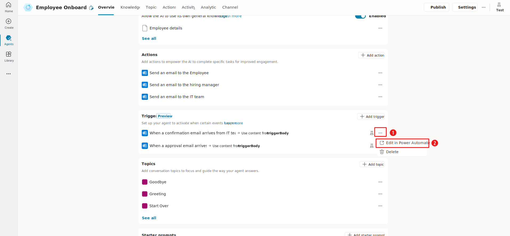

---

18.  To create an action based on specific messages of the event:

- Select **When a new email arrives (V3)** (1).  
- In the **Subject filter section (2)**, add **Account creation request for the Employee** (3).  
- Select **Save draft (4)**.


---

The list of actions and triggers for the Employee Onboarding agent should display under the **Actions and Triggers** sections on the Overview tab.

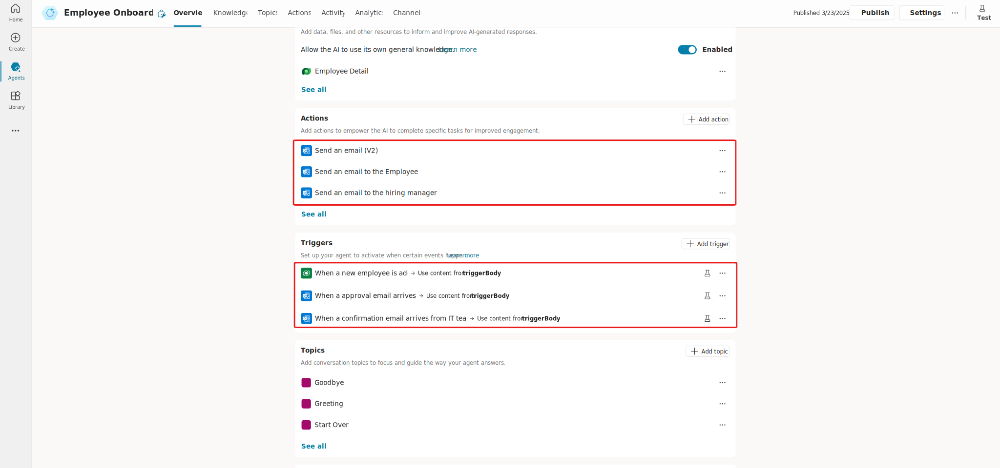
